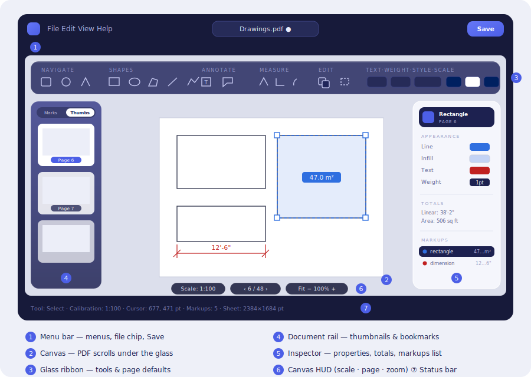
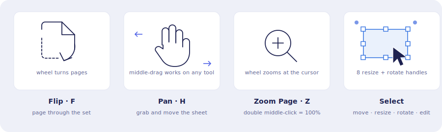
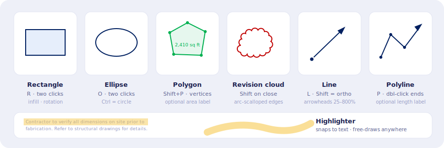
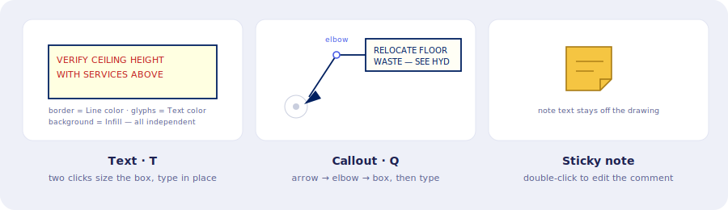
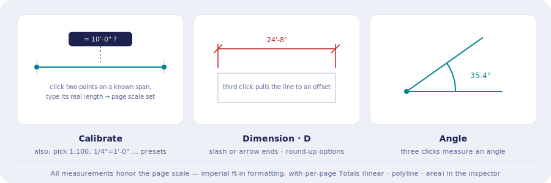
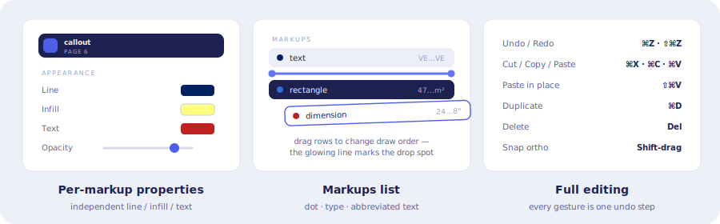
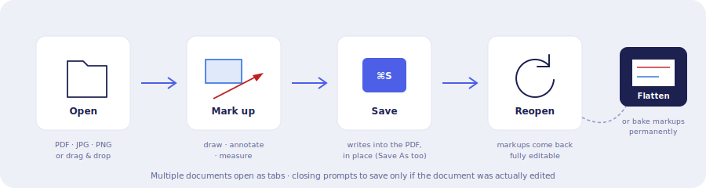
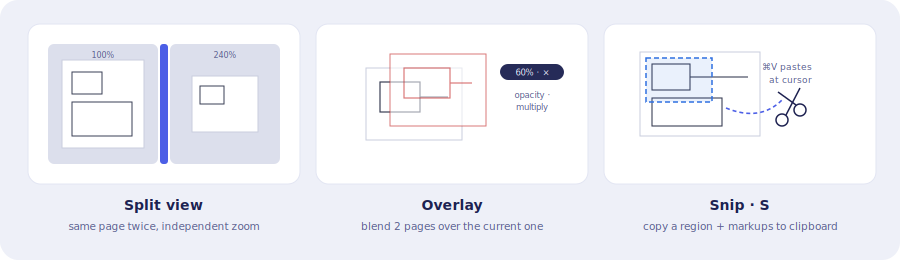

# Markup Studio

A pure-browser PDF viewer and markup tool for architectural and engineering
drawings — a lightweight "Bluebeam-lite" that runs entirely client-side.
No server, no account, no upload: your drawings never leave your machine.

The interface is an *Aurora liquid glass* design: the sheet fills the whole
window and the toolbar, side panels and viewer controls float above it as
frosted-glass overlays, so the drawing shows through, blurred.



## Quick start

```bash
npm install
npm run dev
```

Open the printed URL (typically `http://localhost:5173`) in **Chrome or
Edge**, then use **File → Open** or drag a PDF / JPG / PNG anywhere onto the
window.

---

## Navigate

Four ways to move around the sheet. After you finish drawing a markup, the
app automatically returns to the last navigation tool you used.



- **Flip (F)** pages through the set — the scroll wheel turns pages.
- **Pan (H)** grabs the sheet; middle-drag (or Alt-drag) pans on *any* tool.
- **Zoom Page (Z)** zooms with the wheel at the cursor; a double middle-click
  snaps back to 100%.
- **Select** is the editing tool: click a markup to select it, drag its body
  to move, drag the 8 handles to resize, and drag the corner-outside handles
  to rotate rectangles and ellipses. Double-click text markups to edit them.

## Shapes

All shapes pick up the page defaults (color, weight, line style) from the
ribbon, and each one can be overridden afterwards in the inspector.



- **Rectangle (R) / Ellipse (O)** — two clicks place opposite corners, with
  live preview. Both support infill, rotation, and line weight/style.
- **Polygon (Shift+P)** — click each vertex; double-click or click the start
  point to close. Toggle a centered **area label** in the inspector.
- **Revision cloud** — hold Shift when closing a polygon to turn its edges
  into arc scallops.
- **Line (L) / Polyline (P)** — Shift locks segments orthogonal. Start/end
  arrowheads are 1:1 triangles adjustable from 25% to 800% of line weight.
- **Highlighter** — over PDF text it snaps line-by-line to the text run;
  over blank drawing areas it free-draws a fat translucent marker.

## Annotate



- **Text (T)** — two clicks size the box, then type directly on the sheet.
  The box **border** uses the Line color, the glyphs use the **Text** color,
  and the background uses the **Infill** color — all three independent.
- **Callout (Q)** — three clicks: arrow tip → leader elbow → text box, then
  type. The leader always exits the box horizontally and bends at the elbow,
  which has its own drag handle.
- **Sticky note** — a folded-corner note icon whose comment text stays off
  the drawing; double-click to edit.

## Measure



- **Calibrate** — click two points across a known distance and type its
  real-world length; this sets the page **scale**. You can also pick a preset
  (architectural `1/4" = 1'-0"` … or engineering `1" = 100'`) in the ribbon.
- **Dimension (D)** — click the two measured points, then a third click pulls
  the dimension line away to an offset. Architectural slash ticks or arrows,
  optional round-up (¼", 1", 6", 1'), and the value always reads parallel to
  the line.
- **Angle** — three clicks measure and label an angle.
- Per-page **Totals** (linear, polyline, area) accumulate in the inspector.

## Properties & organizing



- Selecting a markup opens its properties: **Line / Infill / Text colors**
  (each overriding the page defaults independently), weight, line style,
  opacity, rotation, arrows, fonts, and measurement options.
- The **Markups list** shows every markup on the page — color dot, type, and
  the markup's text abbreviated to its first and last letters. Click to
  select; **drag rows to change the draw order**, guided by a glowing
  insertion line.
- Full editing everywhere: undo/redo history, cut/copy/paste,
  paste-in-place, duplicate — every gesture is exactly one undo step.

## Documents: open → save → reopen



Saving writes the markups into the PDF itself — both as visible vector
content and as recoverable metadata — so a saved file **reopens with every
markup still editable**. Use **Edit → Flatten** to bake markups permanently
into the page instead. Saving uses the File System Access API to write in
place (with Save As and download fallbacks). Images (JPG/PNG) open wrapped
in a single PDF page.

## Advanced



- **Split view** — duplicate the active page in a second pane (vertical or
  horizontal) with its own independent zoom; drag the divider to resize.
- **Overlay** — composite up to two other pages over the current one with
  per-slot opacity and an optional Photoshop-style Multiply blend — ideal
  for comparing revisions.
- **Snip (S)** — drag a region to copy that patch of page *plus its markups*
  to the clipboard; Ctrl+V pastes it at the cursor.
- Right-click a thumbnail to **insert blank pages** (Letter → ARCH E) or
  **rotate** a page.

## Keyboard shortcuts

| Keys | Action |
| --- | --- |
| `F` `H` `Z` | Flip / Pan / Zoom Page |
| `R` `O` `Shift+P` `L` `P` | Rectangle / Ellipse / Polygon / Line / Polyline |
| `T` `Q` `D` `S` | Text / Callout / Dimension / Snip |
| `Ctrl/⌘ S` | Save |
| `Ctrl/⌘ Z` · `Shift+Z` / `Ctrl+Y` | Undo · Redo |
| `Ctrl/⌘ X · C · V` | Cut · Copy · Paste |
| `Ctrl/⌘ Shift V` | Paste in place |
| `Enter` / `Esc` | Finish / cancel an in-progress shape |
| `Delete` | Remove selection |
| `Shift` (while drawing) | Lock orthogonal / revision cloud on close |

## Stack

- **Vite + TypeScript** — no framework, a small custom reactive store
- **PDF.js** (legacy build) — rendering
- **pdf-lib** — writing markups back into the PDF, flatten, new pages
- **File System Access API** — open and save in place (Chrome/Edge)

```bash
npm run build    # type-check + production build
npm run preview  # serve the production build
```

> **Note on Google Drive folders:** exclude `node_modules/` and `dist/` from
> Drive sync to avoid syncing thousands of build files.
